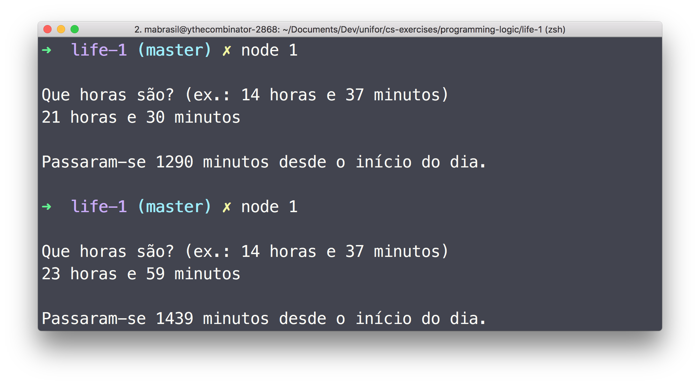
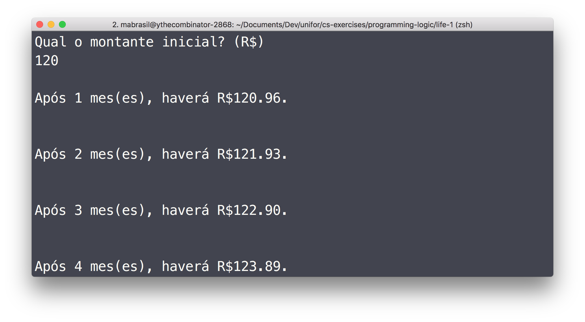
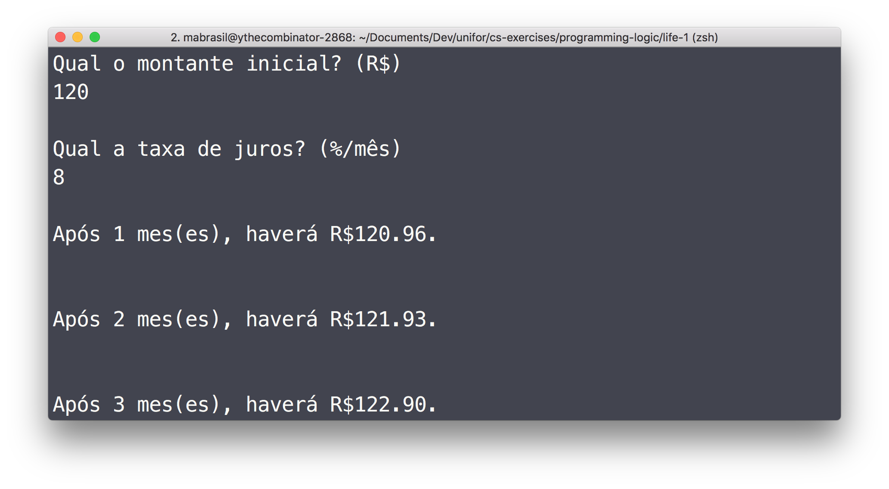
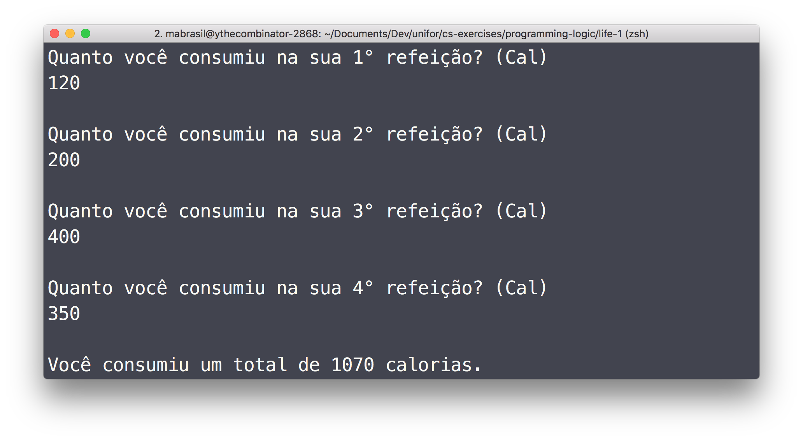
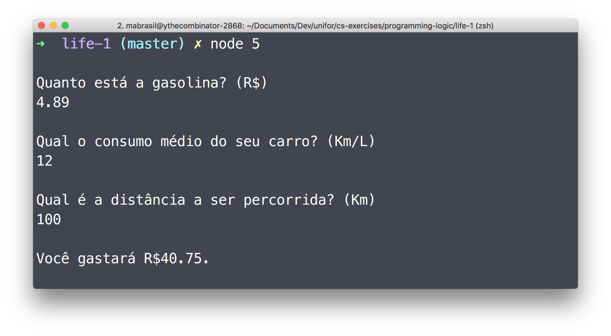
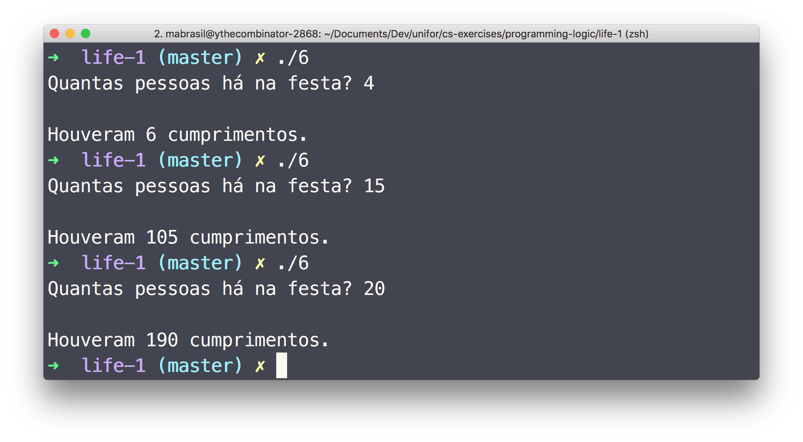
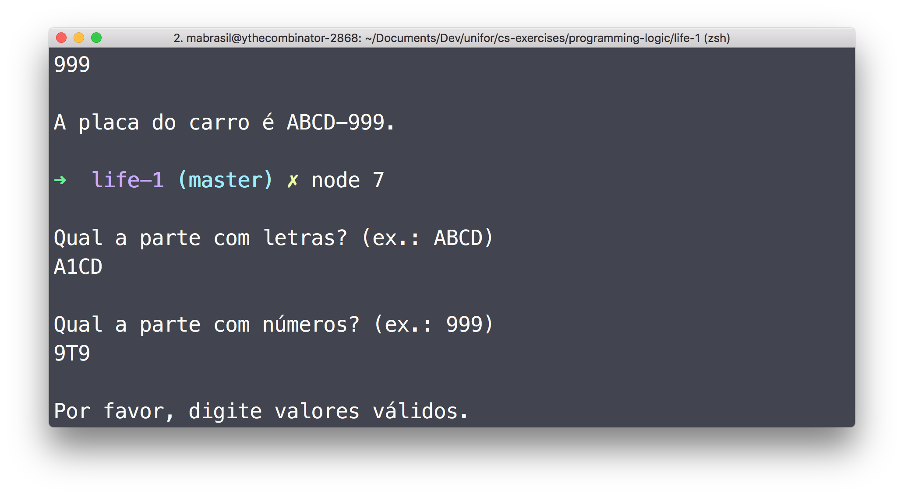

### Instructions

#### JavaScript

1.   Make sure you have [nodejs LTS](https://nodejs.org/en/download/) installed.

1.   Clone this repo.

      ```sh
      git clone https://github.com/ythecombinator/cs-exercises
      ```

1.   Navigate to this directory.

      ```sh
      cd programming-logic/life-1
      ```

1.   Run the desired solutin.

      ```sh
      node <questionNumber>

      # e.g.
      node 7.js
      ```

#### C

1.   Clone this repo.

1.   `cd` into this directory.

1.   Compile the desired solution with the C distribution of your choice.

      ```sh
      gcc -o <questionNumber> <questionNumber>.c

      # e.g.
      gcc -o 6 6.c
      ```

1.   Run the generated binary:

      ```sh
      ./<questionNumber>

      # e.g.
      ./6
      ```

### Exercises

1.   Write a program that reads an input containing a specific hour in a day (e.g. 14 hours and 37 minutes) and tell the user how many minutes have passed from the beginning of the day to that hour. Then write a function to receive the hours and minutes and return the minutes.

1.   Write a program that reads an initial deposit amount into a financial application with a 0.8% profit rate. Then show on the screen the value of the application balance after each month for 6 months.

1.   Change the previous exercise so that the profit rate will also be a value provided by the user.

1.   Write a JavaScript program that reads the amount of calories consumed in four meals and shows on the screen the total calories consumed. Challenge: Use only one variable for reading calories.

1.   You will be traveling by car and you want to know how much you should spend on fuel. Write a program that reads the value of gasoline, the average fuel consumption of the car, and the distance to be traveled, and calculate the amount to be spent on fuel.

1.   In a party, everyone greet each other once. Write a program in C that reads the amount of people in the party and displays the amount of greetings.

1.   Write a program that reads three letters and four digits separately and shows them on the screen in the form of a Brazilian car plate (e.g. AAA-9999).

### Solutions

Here are screenshots of the working solutions.

#### 1



#### 2



#### 3



#### 4



#### 5



#### 6



#### 7


