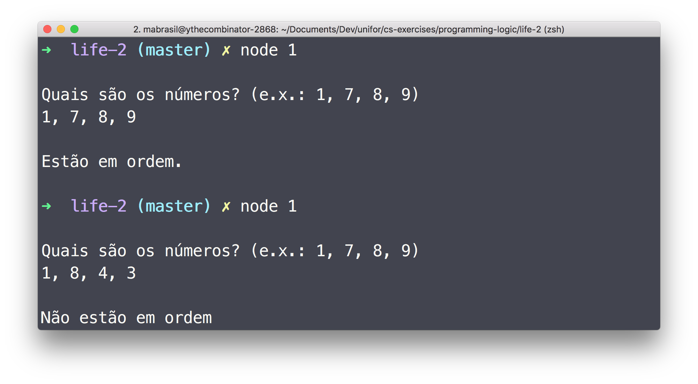
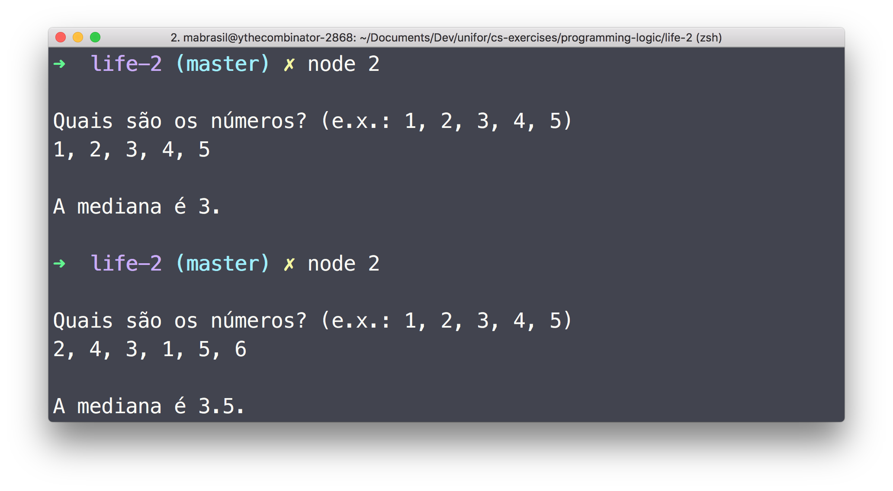

### Instructions

#### JavaScript

1.   Make sure you have [nodejs LTS](https://nodejs.org/en/download/) installed.

1.   Clone this repo.

      ```sh
      git clone https://github.com/ythecombinator/cs-exercises
      ```

1.   Navigate to this directory.

      ```sh
      cd programming-logic/life-2
      ```

1.   Run the desired solutin.

      ```sh
      node <questionNumber>

      # e.g.
      node 1.js
      ```

### Exercises

1.   Write a program that receives fours numbers and check if they are sorted–e.g. `{1, 7, 8, 9}` is a sorted list but `{1, 8, 4, 3}` is not.

1.   Write a program that reads five numbers and print their median.

### Solutions

Here are screenshots of the working solutions.

#### 1



#### 2


