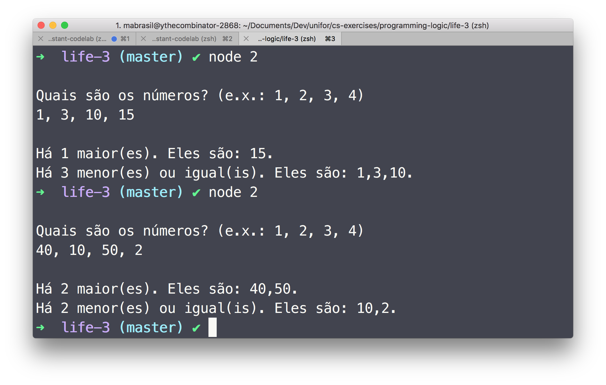
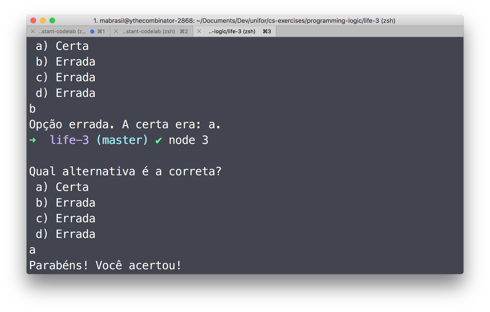
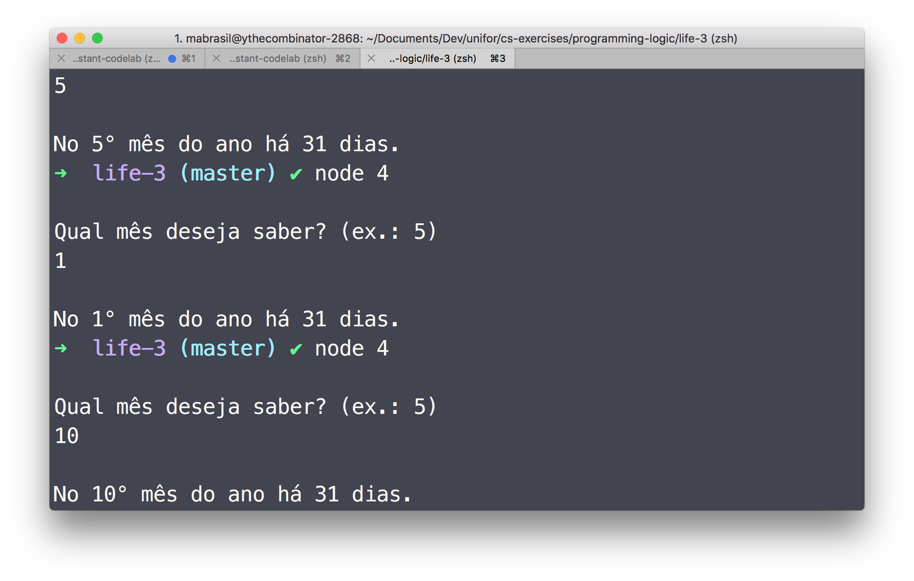
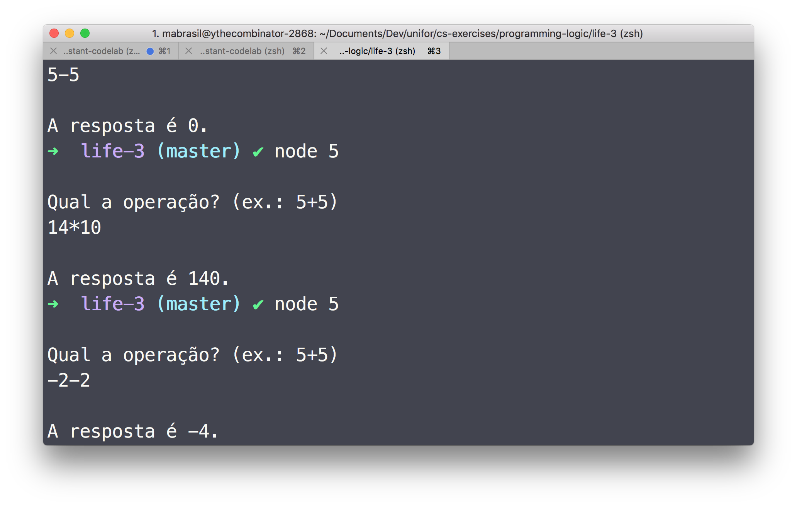

### Instructions

#### JavaScript

1.  Make sure you have [nodejs LTS](https://nodejs.org/en/download/) installed.

1.  Clone this repo.


    ```sh
    git clone https://github.com/ythecombinator/cs-exercises
    ```

1.  Navigate to this directory.


    ```sh
    cd programming-logic/life-3
    ```

1.  Run the desired solutin.


    ```sh
    node <questionNumber>

    # e.g.
    node 1.js
    ```

### Exercises

2.  Write a program that receives four numbers and tells the user how many of them are bigger than 10 and how many are smaller or equal.

3.  Write a JavaScript program that displays one question and four alternatives (a, b, c, d)–of which only one is correct. The program should receive an input letter from the user, corresponding to their answer, and inform if the answer is correct, incorrect or if the option chosen is invalid.

4.  Write a program that receives the month (ranged from `1` to `12`) in 2015 and tells the user how many days it lasted.

5.  You should write a simple calculator which handles the four basic arithmetic operations. The program should read the operation, the first operand and the second operand, displaying the then the result.

### Solutions

Here are screenshots of the working solutions.

#### 2



#### 3



#### 4



#### 5


