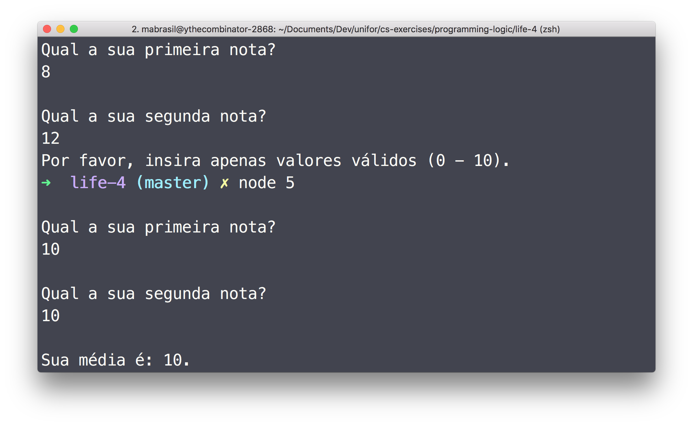

### Instructions

#### JavaScript

1.  Make sure you have [nodejs LTS](https://nodejs.org/en/download/) installed.

1.  Clone this repo.


    ```sh
    git clone https://github.com/ythecombinator/cs-exercises
    ```

1.  Navigate to this directory.


    ```sh
    cd programming-logic/life-4
    ```

1.  Run the desired solutin.


    ```sh
    node <questionNumber>

    # e.g.
    node 1.js
    ```

### Exercises

1.  Write an algorithm to print the first `n` integers; being `n` informed by the user.

1.  Write a program that receives an initial amount, a monthly interest amount and a range of months, displaying, for each month, the balance.

1.  Write a JavaScript program that receives a number `n` and draws a right triangle with base and height of `n` stars. The example below considers `n = 5`:

```sh
*
**
***
****
*****
```

1.  Write a program that receives an integer value `n`, and then read `n` numbers, showing, at the end, the largest of them. Tip: You don't need to store the numbers.

1.  Write an algorithm to read both 1st and 2nd grades, calc the arithmetic mean and then prints it. Only valid values (0 - 10) should be accepted for each grade.

1.  Add a message 'NOVO CÁLCULO? (S / N)?' at the end of the previous question. If 'S' is answered, it must return and perform a new calculation, otherwise it should terminate the program.

### Solutions

Here are screenshots of the working solutions.

#### 1


#### 2


#### 3


#### 4


#### 5


